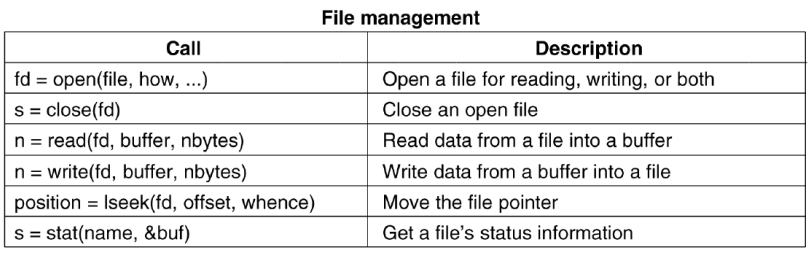
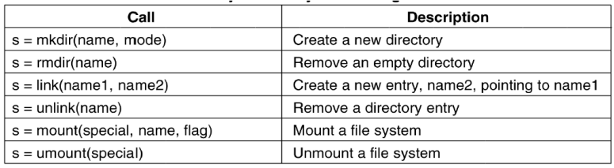
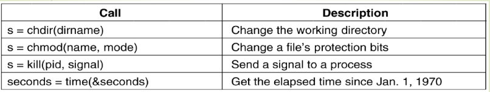

# Sistem Operasi

## Definisi

Aplikasi yang meringkas/mengontrol/menjembatani akses ke sumber daya hardware.

## Hardware

Sumber daya hardware dapat meliputi:

1. Komputasi (CPU)

2. Volatile Storage (Memory) dan Persistent Storage (Disk)

3. Komunikasi (Network, Modem)

4. I/O (Keyboard, Monitor, Printer)

## Software

Software dibagi menjadi 2 macam, yakni:

1. User Mode (Web Browser).

2. Kernel Mode (Operating System)

Agar software pada User Mode dapat mengakses Sumber Daya dari Kernel Mode, maka sebuah **system call** perlu dilakukan.

## Fungsi Operating System

1. Allocation

Mengalokasikan kebutuhan process berdasarkan sumber daya yang dimiliki

2. Protection

Mencegah konflik yang dapat timbul antar aplikasi karena merebut sumber daya yang sama

3. Reclamation

Mengambil **secara paksa** sumber daya yang sedang dipakai oleh sebuah process

4. Virtualization

Membuat ilusi agar beberapa process mampu menggunakan sumber daya yang sama

## OS History

1. The Dark Age (1945-1955)

Pada zaman ini, **OS belum diciptakan**. Membutuhkan `Punch Card` untuk menggunakan komputer. CPU akan idle ketika komputer sedang membaca punch card tersebut.

2. Batch Systems (1955-1965)

Pada zaman ini, OS sudah diciptakan namun hanya digunakan untuk membaca punch card secara otomatis

3. Multiprogramming (1965-1980)

Beberapa task dapat dieksekusi pada waktu yang bersamaan sekaligus. Hal ini memungkinkan untuk lebih dari 1 pengguna menggunakan 1 komputer yang sama.

Adapun OS yang dapat menerapkan multiprogramming pada saat itu, yakni sebagai berikut:

- MULTICS
- UNIX (bahasa C)

4. PC (and mobile) era (1980 - present)

Secara garis besar, berikut merupakan perkembangan PC:

- Processor Intel mulai berkembang.

- Bill Gates mengembangkan MS-DOS (Disk Operating System)

- Linux juga mulai berkembang sebagai open source OS

- OS mulai beralih dari CLI (Command Line Interface) menjadi GUI (Graphical User Interface)

- Windows dan Apple mulai bersaing

## Jenis-jenis OS

1. Mainframe Operating Systems

OS yang digunakan oleh Super Computer.

2. Server Operating Systems

OS yang digunakan pada server

3. Multiprocessor Operating Systems

OS yang dirancang khusus untuk mengoptimasi penggunaan Multicore CPU

4. PC Operating Systems

Windows, Mac, Linux

5. Handheld OS

Android, Iphone, Blackberry

6. Embedded OS

OS yang terpasang pada embedded System, seperti TV, Game Console, dll.

7. Sensor Node Opearting Systems

OS untuk sensor kecil

8. Real Time Operating Systems

OS yang dirancang untuk mengeksekusi task dengan batasan waktu yang sangat ketat (ex: microcontroller).

9. Smart Card Operating Systems

Jenis OS terkecil yang berjalan pada kartu kredit.

## Konsep Operating System

### Process

Sebuah program yang sedang dieksekusi. Setiap process memiliki UID (Unique ID) dan GID (Group ID), serta terletak dalam **address space**. Adapun process table yang memuat seluruh informasi mengenai process (biasanya digunakan untuk melakukan restart process). Sebuah process dapat melakukan komunikasi dengan process lainnya menggunakan IPC.

### System Calls

System Call bertindak sebagai penjembatan antara User Program dan Operating System.

#### SysCall untuk File Management

#### SysCall untuk Directory Management

#### Other SysCall

#### Cara Kerja

`Count = read(fd, buffer, nbytes)`

1. Push nbytes
2. Push &buffer
3. Push fd
4. Call read
5. Simpan kode untuk read pada register
6. Kirim kode tersebut ke Kernel
7. Kode dieksekusi pada kernel
8. Kembali ke User Program
9. Increment SP

# Computer Architecture

## CPU

CPU bertindak sebagai otak dari komputer. CPU menyimpan Instruction Set (x86/ARM) dan **register khusus**. Komputer juga memiliki **register umum** yang dapat digunakan untuk Program Counter, Stack Pointer, PSW (Program Status Word).

Komputer bekerja secara bertahap dengan urutan berikut:

1. Fetch instruksi dari memori
2. Decode Instruksi
3. Execute Instruksi

**Pipelining** dapat diimplementasikan untuk meningkatkan kinerja dari performa komputer. Sebuah register buffer diletakkan antara proses decode Instruksi dan Execute Instruksi, sehingga CPU dapat men-decode instruksi berikutnya, tanpa harus menunggu eksekusi instruksi saat ini selesai.

## Multithreading

Moore's Law menyatakan bahwa jumlah transistor komputer akan meningkat 2 kali lipa setiap 18 bulan. Oleh sebab itu, multicore perlu diterapkan untuk mencegah kepadatan transistor pada single core. Untuk memanfaatkan sumber daya multicore, maka multithreading harus diimplementasikan.

## Memory

### Memory Segment

1. Text Segment
2. Data Segment
3. Stack Segment

### Memory Hierarchy

1. Registers dengan kapasitas < 1KB dan access time 1 nsec.

2. Cache dengan kapasitas 4 MB dan access time 2nsec

3. Main memory dengan kapasitas 1-8 GB dan access time 10 nsec

4. Magnetic disk dengan kapasitas 1-4 TB dan access time 10 msec

### Cache

Cache menyimpan informasi data yang sering diakses oleh CPU, agar CPU tidak perlu mengakses ke Main Memory untuk mencari data tersebut. **Cache Hits** terjadi ketika informasi yang dicari berada di Cache, sedangkan **Cache Miss** terjadi ketika informasi yang dicari tidak ada di Cache.

### Disks

Data pada disks dibagi menjadi beberapa sector, dimana setiap sector memiliki 2 surface (ex: 4 sector memiliki 8 surface). Setiap sector umumnya memuat 512 bytes.

## I/O

Mekanisme Input/Output antara lain sebagai berikut:

1. Sebuah User Program memanggil System Call

2. Driver pada Kernel yang terlibat akan menjalankan perangkatnya untuk input/output.

3. Ketika perangkat sudah selesai berjalan, maka akan mengirim permintaan Interrupt pada CPU.

4. CPU akan menentukan apakah interrupt diterima atau tidak. Apabila interrupt diterima, maka instruksi saat ini yang sedang dijalankan akan di hold pada stack, lalu pindah mengeksekusi interrupt tersebut. Apabila interrupt ditolak, maka CPU akan terus menjalankan instruksi saat ini.

