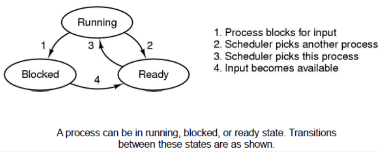
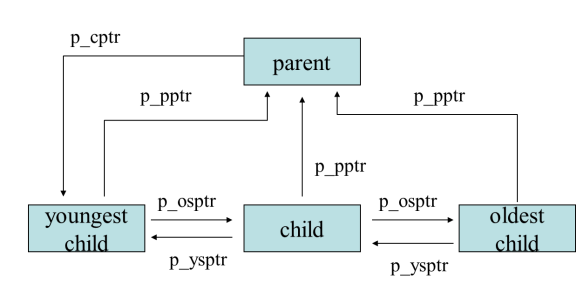

# Process

## Definisi

Bentuk abstraksi dari program yang sedang berjalan

## PseudoParallelism

Mengeksekusi beberapa program secara paralel dengan hanya 1 Core CPU

## Multiprogramming

Setiap Process dapat dijalankan secara bersamaan dengan Program Counternya masing-masing, namun CPU hanya akan mengeksekusi satu process pada satu saat secara bergantian. Agar paralelisme dapat terwujud, maka CPU akan berpindah-pindah proses secara berkala, atau disebut juga sebagai **process switching**.

## Jenis Process

1. Foreground Process

Process yang membutuhkan interaksi pengguna untuk berjalan

2. Daemon (Background Process)

Process yang berjalan tanpa membutuhkan interaksi pengguna untuk berjalan

## PID

1. Child Process mengembalikan Process ID = 0.
2. Parent Process mengembalikan Process ID = Child PID.


## Process Switching
Process Switching adalah proses ketika CPU mem-block sebuah process untuk berpindah mengerjakan process lainnya. Cost dari Process Switching cukup **besar**.

## Process Creation

Sebuah process dapat diciptakkan oleh faktor-faktor sebagai berikut:

1. System Initialization
2. Process Creation SysCall dari Process yang sedang berjalan
3. Permintaan User untuk membuat Process Baru
4. Initiation of a Batch Job

## Process Termination

1. Normal Exit (voluntary)
2. Error Exit (voluntary)
3. Fatal Error (involuntary)
4. Killed by another process (involuntary)

## Process States

3 State yang dimiliki Process:

1. Ready
2. Running
3. Blocked

Cara kerja:

1. CPU akan mengambil process yang berada dalam state `Ready`

2. CPU akan mengeksekusi process tersebut sehingga berada dalam state `Running`

3. Apabila pada suatu saat process harus idle, maka process akan masuk ke state `Blocked`

4. Apabila process memasuki state `Blocked` **atau** process state `Running` selesai dieksekusi, maka CPU akan memilih process baru yang berada dalam state `Ready`

Visualisasi:



## CPU Utlilization

$$
CPUutilization = 1-p^n
$$

dimana,

- n adalah jumlah process
- p adalah persentase process berada dalam kondisi idle atau I/O

## Task Struct

Setiap process pada linux dapat direpresentasikan menggunakan struktur data **task_struct**.

```c
struct task_struct{
    struct task_struct *next_task;
    struct task_struct *prev_task;
}
```

## Task Vector

Task Vector berisikan maksimum 512 elemen, yang dimana masing-masing elemen tersebut adalah pointer terhadap sebuah task_struct.

## PCB

Process Control Blocks berisikan semua informasi yang dibutuhkan agar sebuah Process dapat berjalan dengan semestinya.

## Process Relationship



1. p_pptr
    >Pointer yang menunjuk Parent Process
2. p_cptr
    >Pointer yang menunjuk Child Process paling muda
3. p_osptr
    >Pointer yang menunjuk Sibling Process lebih tua
4. p_ysptr
    >Pointer yang menunjuk Sibling Process lebih muda

## Process Function

- `pid_t getpid(void)`

Digunakan untuk mendapatkan Process ID sebuah Child Process

- `pid_t getppid (void)`

Digunakan untuk mendapatkan Process ID Parent Process

- `pid_t fork(void)`

Digunakan untuk membuat sebuah Child Process

#### Exec Family

Digunakan untuk memanggil process lain

- `int execvp(const char *file, char *const argv[])`

- `int execv(const char *path, char *const argv[])`

- `int execlp(const char *file, const char *arg,.../* (char  *) NULL */)`

- `int execl(const char *path, const char *arg,.../* (char  *) NULL */)`

- `int execvpe(const char *file, char *const argv[],char *const envp[])`

